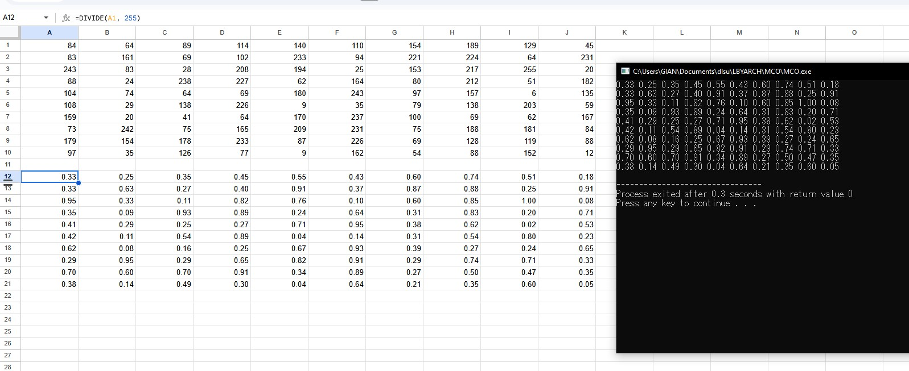

# LBYARCH_MCO2
## Execution time
The following table lists the execution times for both C and x86-64 and their averages for a 10x10 image.
| Execution | C | x86-64 |
| --- | --- | --- |
| 1 | 0.35 | 0.10 |
| 2 | 0.22 | 0.11 |
| 3 | 0.23 | 0.13 |
| 4 | 0.22 | 0.18 |
| 5 | 0.24 | 0.12 |
| 6 | 0.31 | 0.15 |
| 7 | 0.28 | 0.16 |
| 8 | 0.26 | 0.17 |
| 9 | 0.28 | 0.15 |
| 10 | 0.27 | 0.14 |
| 11 | 0.24 | 0.16 |
| 12 | 0.26 | 0.16 |
| 13 | 0.26 | 0.16 |
| 14 | 0.28 | 0.15 |
| 15 | 0.25 | 0.14 |
| 16 | 0.25 | 0.16 |
| 17 | 0.28 | 0.14 |
| 18 | 0.27 | 0.16 |
| 19 | 0.26 | 0.15 |
| 20 | 0.26 | 0.14 |
| 21 | 0.27 | 0.15 |
| 22 | 0.26 | 0.16 |
| 23 | 0.24 | 0.17 |
| 24 | 0.25 | 0.15 |
| 25 | 0.26 | 0.15 |
| 26 | 0.21 | 0.16 |
| 27 | 0.22 | 0.15 |
| 28 | 0.28 | 0.15 |
| 29 | 0.24 | 0.16 |
| 30 | 0.23 | 0.17 |
| Average | 0.26 | 0.15 |

## Correctness Check

